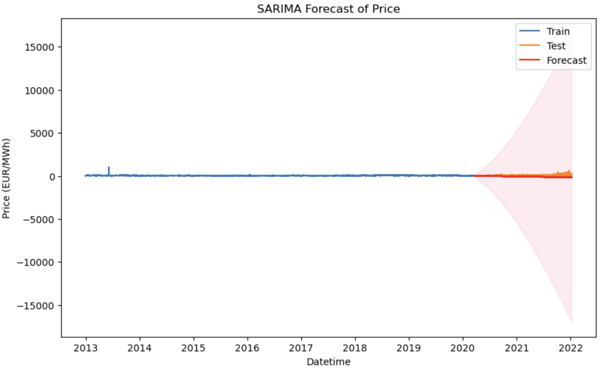
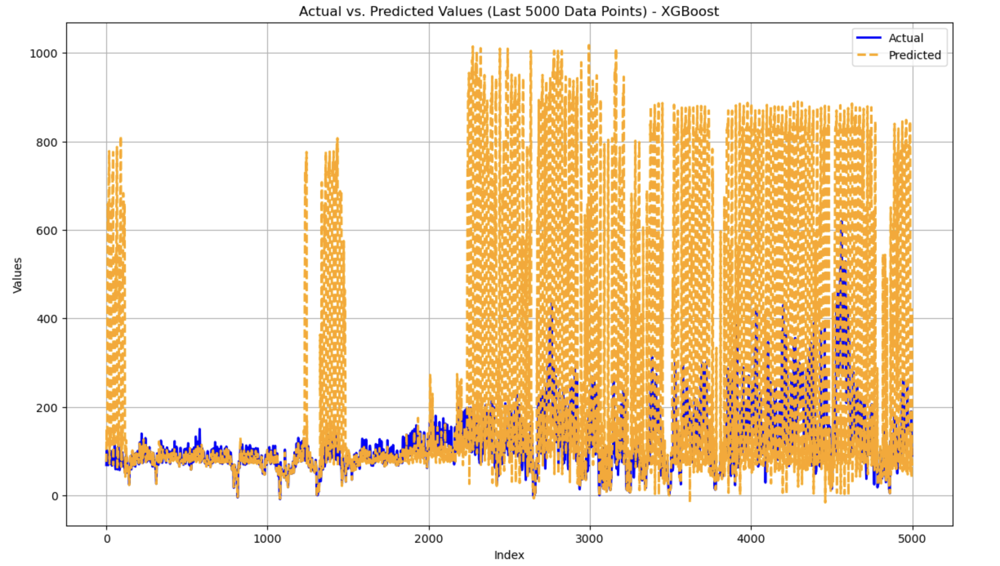

# Time-series-Modeling-of-EU-Energy-Market

### Abstract

The increasing integration of renewable energy sources in European markets has resulted in frequent occurrences of negative electricity prices, posing challenges for market stability and profitability. This study presents a predictive framework that utilizes Long Short-Term Memory (LSTM), Seasonal Autoregressive Integrated Moving Average (SARIMA), and extreme Gradient Boosting (XGBoost) to analyze the duration and recovery of negative price events. By leveraging historical electricity price data, the model improves forecasting accuracy, enabling energy stakeholders to enhance risk management and strategic planning. Among the approaches explored, LSTM demonstrated strong predictive performance, effectively capturing temporal dependencies in electricity price fluctuations. The results highlight the potential of advanced machine learning and time series models in mitigating risks associated with negative price events, contributing to a more resilient and sustainable energy market.

### Methodology

The methodology for this study follows the CRISP-DM (Cross-Industry Standard Process for Data Mining) framework, which is widely used for structured data mining projects. 
The CRISP-DM framework consists of six main phases: Business Understanding, Data Understanding, Data Preparation, Modeling, Evaluation, and Deployment. Below is a breakdown of how each phase is applied in this study:

### 1.Business Understanding:

The principal objective of this study is to design a comprehensive and effective predictive framework for identifying and analyzing negative electricity price events within the European energy market. The study focuses on improving the accuracy of forecasts and conducting an in-depth exploration of the factors that influence the onset, duration, and recovery of such events. By generating actionable insights, this research aims to strengthen risk management practices and promote the stability and resilience of energy markets. This is particularly critical given the increasing integration of renewable energy sources, and the findings are intended to support informed decision-making among market participants and policymakers while addressing the challenges posed by price volatility.

### 2.Data Understanding:

This study utilizes the European Union Energy Market Data dataset, which consists of electricity price records across multiple European countries, covering various timestamps. Key attributes include date, hour, country, price (in EUR per MWh), energy type (green or non-green), and currency type. Preliminary exploration revealed several important characteristics and anomalies. The is-green-energy attribute serves as a binary indicator, identifying whether the energy source is classified as green. The hour attribute is within the valid range of 1 to 24, ensuring proper time representation. Notably, negative price values are present, indicating market conditions where electricity prices drop below zero. Additionally, the currency-type attribute consists of values 1 and 2, corresponding to EUR and USD, respectively. The dataset initially contained the date attribute in an object format, which was converted to a datetime format for enhanced usability. No missing values were identified, ensuring data completeness.

Feature selection and refinement were crucial in preparing the dataset for analysis. The data-source and last-updated attributes were removed as they did not contribute to predictive modeling. To maintain data consistency, records with non-EUR currency were discarded since USD pricing was only relevant for the United Kingdom. Furthermore, the EU-country attribute was mapped to corresponding country names, and records labeled as 'System' or 'Unknown' were excluded. These adjustments ensured that the dataset contained only relevant and interpretable information.

Electricity price trends varied significantly across countries for the same day and hour, reinforcing the necessity of focusing on a single market for precise modeling. Among all countries, Denmark exhibited price trends closely aligned with the overall market average, making it an ideal candidate for forecasting. This observation is evident in Figure 1, which compares the average monthly price trends of all countries, and Figure 2, which presents the total average of these countries. Denmark's trend closely follows the overall market pattern, further validating its selection. Additionally, Denmark recorded the highest number of negative price occurrences, with 1,198 cases, highlighting the need for an accurate predictive model.

### Figure 1:

### Figure 2:

Green energy sources played a significant role in negative pricing events, particularly in the Netherlands, France, and Austria. A comparative analysis of green and non-green energy prices showed that green energy had an average price of 40.96 EUR/MWh, whereas non-green energy was priced higher at an average of 45.30 EUR/MWh. The dataset also contained multiple price records per hour, potentially due to different price zones or market segments, necessitating aggregation for accurate modeling.

Several extreme values or outliers were observed within the dataset. However, given that these extreme price points could represent valid high/low prices due to market fluctuations such as supply \& demand, inflation, or energy crises, we decided to retain them. Additionally, some of these outliers could be seasonal, such as winter or summer spikes in energy demand, and might carry valuable information for forecasting future price trends.

In this study, we aslo analyzed the dynamics of negative electricity prices, focusing on their duration and recovery. The data revealed several significant trends. Negative prices typically do not last long, with most data points concentrated around low durations. When negative prices persist for longer periods, the prices tend to remain low even after the negative period has ended. Additionally, extreme price spikes are often observed when the negative price duration is zero, which suggests that high prices are typically associated with periods where negative prices do not occur at all.

Moreover, we found that higher electricity prices correlate with higher price volatility, where price swings become more pronounced during periods of high prices. In contrast, when prices are very low, including negative prices, volatility tends to remain relatively stable, with less dramatic fluctuations. Interestingly, price spikes above 1000 EUR/MWh were associated with extremely high volatility, indicating sudden and unpredictable price changes. These observations are essential for understanding the underlying behavior of electricity prices and their volatility, especially in the context of forecasting negative price events.

### 3.Data Preparation:

To enhance data management and ensure consistency, the column names in the dataset were standardized. The original column names were renamed to more intuitive labels, improving readability and ease of use. Specifically, the column fecha was renamed to date, hora to hour, sistema to EU-country, bandera to is-green-energy, precio to price-eur-per-mwh, tipo-moneda to currency-type.

To address the presence of multiple records per hour, data aggregation was performed to obtain a single representative price per timestamp. The dataset was grouped by date and hour, computing key statistics such as the mean electricity price, the maximum indicator for negative prices, the longest duration of negative pricing within the hour, and the highest recorded green energy indicator. This ensured that the aggregated dataset accurately captured essential market dynamics while minimizing redundancy.

Feature engineering played a pivotal role in enhancing forecasting accuracy. Several time-based features were introduced, including the month, day of the week, and a binary indicator for weekdays to capture seasonal and weekly consumption patterns. Sine and cosine transformations of the hour attribute were applied to effectively model the cyclical nature of electricity prices. Additionally, price-based features were engineered, such as price lags (1-hour, 2-hour, and 3-hour), rolling averages (7-day and 30-day), hourly price differences, and price volatility over 24-hour and 7-day periods. These features provided valuable insights into short-term fluctuations and long-term price stability.

To further improve predictive performance, target-specific features were introduced. A binary indicator for negative price occurrences helped identify critical market conditions, while the negative price duration feature captured how long negative pricing persisted. These attributes were essential for modeling recovery patterns and understanding prolonged negative price events. By applying these comprehensive data preparation techniques, the dataset was transformed into a structured format, ensuring optimal forecasting accuracy and enabling robust insights into negative price fluctuations in the Danish electricity market.

### 4.Modeling:

To develop an effective forecasting framework for negative electricity price events, three distinct models were implemented: Seasonal Autoregressive Integrated Moving Average (SARIMA), Long Short-Term Memory (LSTM) networks, and Extreme Gradient Boosting (XGBoost). Each model was chosen based on its suitability for time series forecasting, capturing different aspects of price fluctuations and negative price durations.The following subsections provide a detailed discussion of each model’s implementation:

### SARIMA:
The Seasonal Autoregressive Integrated Moving Average (SARIMA) model was implemented to capture the temporal dependencies and seasonality in electricity price fluctuations. SARIMA is particularly effective for time series data exhibiting periodic trends, making it well-suited for modeling electricity prices, which show daily and seasonal variations. By incorporating both autoregressive and moving average components along with seasonal adjustments, SARIMA can effectively model price patterns influenced by cyclical demand and supply factors.

To ensure a structured training process, the dataset was divided into training and testing sets, with 80\% of the data allocated for training and the remaining 20\% reserved for testing. The chronological order of the data was preserved to prevent data leakage, maintaining the integrity of temporal patterns. The datetime index was set to an hourly frequency, aligning with the dataset's granularity. Missing values were handled using forward-filling, ensuring continuity and completeness in the time series data. The price-eur-per-mwh column was selected as the target variable for forecasting, as it represents the core metric of interest.

For model specification, a SARIMA model with the order (1,1,1) and seasonal order (1,1,1,24) was chosen. Here, (p, d, q) = (1,1,1) represents the autoregressive (AR) term, differencing (I), and moving average (MA) components for non-seasonal variations, ensuring that the model captures trends while making the data stationary. The seasonal component (P, D, Q, S) = (1,1,1,24) accounts for daily seasonality, with S = 24 reflecting the hourly nature of the data. This configuration allows the model to capture both short-term dependencies and cyclical price fluctuations influenced by energy market dynamics.

### XGBoost:

Extreme Gradient Boosting (XGBoost) was employed to capture complex nonlinear relationships in electricity price fluctuations. XGBoost is an ensemble learning method that constructs multiple decision trees sequentially, optimizing for predictive accuracy while efficiently handling large datasets. Given its capability to incorporate multiple features and capture intricate dependencies, XGBoost is particularly well-suited for forecasting electricity prices, which are influenced by various market dynamics and external conditions.

To enhance the predictive power of the model, a set of engineered features was carefully selected. These features included time-related variables such as hour, month, day of the week, sine-hour, cosine-hour, and is-weekday, which help in capturing periodic trends. Additionally, is-negative-price and negative-price-duration were introduced to account for negative price occurrences, while is-green-energy incorporated the influence of renewable energy sources on electricity prices. Several lag-based indicators, including price-lag-1, price-lag-2, price-lag-3, price-rolling-7d, price-rolling-30d, price-diff-1h, price-volatility-24h, and price-volatility-7d, were also included to capture past price behaviors and market volatility. The target variable for forecasting was price-eur-per-mwh, representing the electricity price per megawatt-hour.

The dataset was split into training and testing sets, with 80\% allocated for training and 20\% for testing, maintaining chronological order to preserve the temporal structure of the data. To optimize computational efficiency, the training and testing datasets were transformed into DMatrix format, a specialized data structure designed for XGBoost computations.

The XGBoost model was configured with a set of hyperparameters to balance model performance and generalization. The objective function was set to reg:squarederror for regression tasks, with Root Mean Squared Error (RMSE) chosen as the evaluation metric. A learning rate of 0.05 was used to ensure a steady convergence without overfitting. The maximum tree depth was set to 6 to control model complexity, while subsampling (0.8) and column sampling (0.8) were applied to enhance generalization. To ensure reproducibility, the random seed was fixed at 42.

To prevent overfitting, early stopping was implemented, where the training process was halted if the validation loss did not improve for 50 consecutive iterations. After training, the model generated predictions for the test dataset, providing valuable insights into its forecasting capabilities.

### LSTM:

A Long Short-Term Memory (LSTM) neural network was implemented to capture the sequential dependencies in electricity price fluctuations. LSTM, a specialized variant of recurrent neural networks (RNNs), is well-suited for time series forecasting as it can effectively retain long-term dependencies and mitigate vanishing gradient issues. Given the highly volatile and dynamic nature of electricity prices, LSTM was chosen to model the temporal patterns and interactions between multiple influencing factors.

The dataset was preprocessed to enhance the model’s performance. A set of engineered features was selected, including hour, is-negative-price, negative-price-duration, is-green-energy, month, day-of-week, sine-hour, cosine-hour, is-weekday, price-lag-1, price-lag-2, price-lag-3, price-rolling-7d, price-rolling-30d, price-diff-1h, price-volatility-24h, and price-volatility-7d. These variables encapsulate periodic patterns, market behaviors, and historical price trends, enabling the model to learn complex relationships. The target variable for prediction was price-eur-per-mwh.

To ensure numerical stability and improve convergence, Min-Max scaling was applied separately to the features and target variable, transforming values into the range [0,1]. The dataset was then structured into sequences, with a look-back period of 10 time steps, meaning the model was trained to predict the next electricity price based on data from the previous ten time steps. This approach allowed the LSTM network to leverage past observations for improved forecasting accuracy.

The dataset was divided into training and testing sets, maintaining an 80:20 split while preserving the chronological order to prevent data leakage. The input data was reshaped into a three-dimensional format (samples, time steps, features), which is required for LSTM processing.

The LSTM model architecture consisted of a single LSTM layer with 64 units and ReLU activation, followed by a dense output layer to generate the final prediction. The model was compiled using the Adam optimizer with a learning rate of 0.001, and the loss function was set to mean squared error (MSE).

Training was conducted over 100 epochs with a batch size of 32, using validation data to monitor performance. After training, predictions were generated on the test set, and the results were inverse-transformed to recover the actual price values.

## RESULTS AND ANALYSIS

The performance of the three forecasting models—SARIMA, XGBoost, and LSTM—was evaluated using Mean Absolute Error (MAE), Mean Squared Error (MSE), and Root Mean Squared Error (RMSE). These metrics provide insights into each model's predictive accuracy and reliability.
Among the three models, LSTM demonstrated the best performance, achieving the lowest MAE, MSE, and RMSE, along with a high R² score of 0.95, indicating strong predictive accuracy. In contrast, SARIMA and XGBoost showed higher error values, suggesting their limitations in capturing the complex temporal dependencies of electricity price fluctuations.

To further assess model performance, visual analyses were conducted. Figure 3 presents the SARIMA model’s training, test, and forecasted values, illustrating its limitations in capturing price fluctuations. Figure 4 shows the XGBoost model’s actual vs. predicted values, demonstrating its ability to learn patterns but with noticeable prediction errors. Figure 5 visualizes LSTM’s actual vs. predicted values, highlighting its superior performance in capturing price variations. Finally, Figure 6 focuses specifically on LSTM’s predictions for negative price values, showcasing its precision in forecasting such critical events.

### Figure 3

### Figure 4

### Figure 5

### Figure 6

--- 

