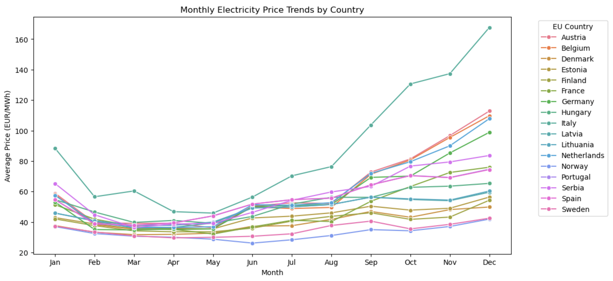
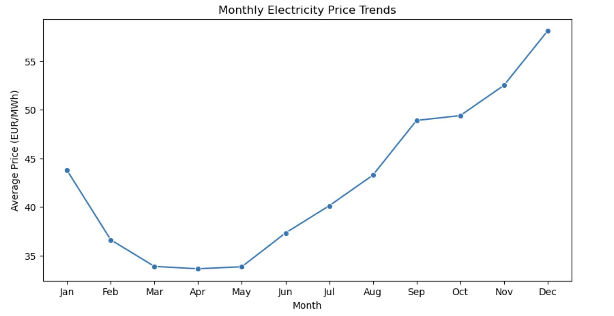

# Time-series-Modeling-of-EU-Energy-Market

### Abstract

The increasing integration of renewable energy sources in European markets has resulted in frequent occurrences of negative electricity prices, posing challenges for market stability and profitability. This study presents a predictive framework that utilizes Long Short-Term Memory (LSTM), Seasonal Autoregressive Integrated Moving Average (SARIMA), and extreme Gradient Boosting (XGBoost) to analyze the duration and recovery of negative price events. By leveraging historical electricity price data, the model improves forecasting accuracy, enabling energy stakeholders to enhance risk management and strategic planning. Among the approaches explored, LSTM demonstrated strong predictive performance, effectively capturing temporal dependencies in electricity price fluctuations. The results highlight the potential of advanced machine learning and time series models in mitigating risks associated with negative price events, contributing to a more resilient and sustainable energy market.

### Methodology

The methodology for this study follows the CRISP-DM (Cross-Industry Standard Process for Data Mining) framework, which is widely used for structured data mining projects. 
The CRISP-DM framework consists of six main phases: Business Understanding, Data Understanding, Data Preparation, Modeling, Evaluation, and Deployment. Below is a breakdown of how each phase is applied in this study:

### Business Understanding:

The principal objective of this study is to design a comprehensive and effective predictive framework for identifying and analyzing negative electricity price events within the European energy market. The study focuses on improving the accuracy of forecasts and conducting an in-depth exploration of the factors that influence the onset, duration, and recovery of such events. By generating actionable insights, this research aims to strengthen risk management practices and promote the stability and resilience of energy markets. This is particularly critical given the increasing integration of renewable energy sources, and the findings are intended to support informed decision-making among market participants and policymakers while addressing the challenges posed by price volatility.

### Data Understanding:

This study utilizes the European Union Energy Market Data dataset, which consists of electricity price records across multiple European countries, covering various timestamps. Key attributes include date, hour, country, price (in EUR per MWh), energy type (green or non-green), and currency type. Preliminary exploration revealed several important characteristics and anomalies. The is-green-energy attribute serves as a binary indicator, identifying whether the energy source is classified as green. The hour attribute is within the valid range of 1 to 24, ensuring proper time representation. Notably, negative price values are present, indicating market conditions where electricity prices drop below zero. Additionally, the currency-type attribute consists of values 1 and 2, corresponding to EUR and USD, respectively. The dataset initially contained the date attribute in an object format, which was converted to a datetime format for enhanced usability. No missing values were identified, ensuring data completeness.

Feature selection and refinement were crucial in preparing the dataset for analysis. The data-source and last-updated attributes were removed as they did not contribute to predictive modeling. To maintain data consistency, records with non-EUR currency were discarded since USD pricing was only relevant for the United Kingdom. Furthermore, the EU-country attribute was mapped to corresponding country names, and records labeled as 'System' or 'Unknown' were excluded. These adjustments ensured that the dataset contained only relevant and interpretable information.

Electricity price trends varied significantly across countries for the same day and hour, reinforcing the necessity of focusing on a single market for precise modeling. Among all countries, Denmark exhibited price trends closely aligned with the overall market average, making it an ideal candidate for forecasting. This observation is evident in Figure 1, which compares the average monthly price trends of all countries, and Figure 2, which presents the total average of these countries. Denmark's trend closely follows the overall market pattern, further validating its selection. Additionally, Denmark recorded the highest number of negative price occurrences, with 1,198 cases, highlighting the need for an accurate predictive model.

### Figure 1:

### Figure 2:

